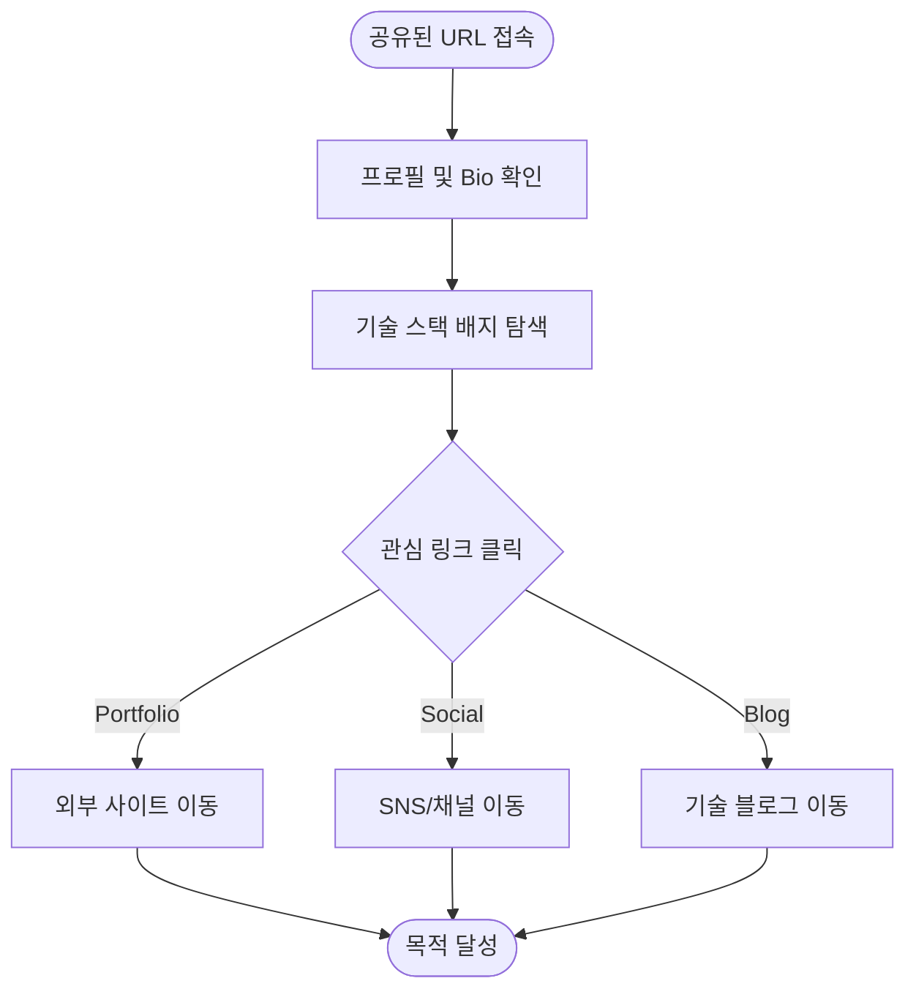
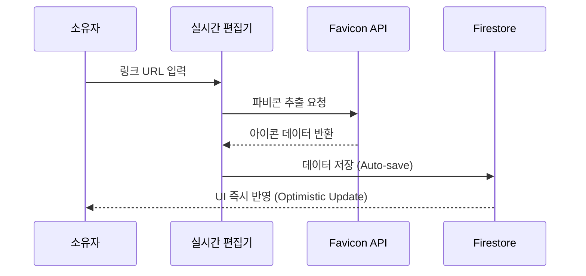

# 🔗 MY LINK: USER SCENARIOS (ver 1.0)

```text
    __  __ __     __  _      ___  _   _  _  __ 
   |  \/  |\ \   / / | |    |_ _|| \ | || |/ / 
   | |\/| | \ \ / /  | |     | | |  \| || ' /  
   | |  | |  \ V /   | |___  | | | |\  || . \  
   |_|  |_|   |_|    |_____||___||_| \_||_|\_\ 
   >> Digital Business Card for Devs & Creators
```

이 문서는 '마이링크' 서비스를 이용하는 두 가지 주요 페르소나의 행동 흐름을 정의합니다.

---

## 1. 방문자 (Visitor) Journey

방문자는 소유자의 프로필을 통해 전문성을 확인하고 외부 채널로 이동합니다.

### 🎨 Visitor Flow Diagram


### 📋 주요 시나리오
| 구분 | 목적 | 행동 (Scenario) |
| :--- | :--- | :--- |
| **탐색** | 통합 정보 확인 | 사용자는 상대방의 통합된 프로필을 확인하기 위해 공유된 URL(`mylink.com/{slug}`)로 접속한다. |
| **검증** | 전문성 파악 | 사용자는 상대방의 주요 기술 역량을 한눈에 보기 위해 상단에 노출된 기술 스택 배지를 확인한다. |
| **이동** | 채널 전환 | 사용자는 상대방이 운영하는 블로그, SNS, 포트폴리오 등으로 이동하기 위해 각 링크 카드를 클릭한다. |
| **반응** | 모바일 최적화 | 사용자는 이동 중에도 불편함 없이 정보를 확인하기 위해 스마트폰 환경에 최적화된 레이아웃을 이용한다. |

---

## 2. 소유자 (Owner) Experience

소유자는 실시간 편집 기능을 통해 자신의 디지털 브랜딩을 관리합니다.

### ⚙️ Link Addition Sequence


### 🛠️ 주요 시나리오

#### 2.1. 인증 및 주소 설정
*   **간편 가입:** 사용자는 나만의 디지털 명함을 빠르게 만들기 위해 구글 계정을 연동하여 자동 가입한다.
*   **주소 커스텀:** 사용자는 기억하기 쉬운 나만의 주소를 갖기 위해 닉네임을 수정하고 이와 동기화되는 **URL 슬러그**를 설정한다.

#### 2.2. 인라인 콘텐츠 관리
*   **실시간 브랜딩:** 사용자는 방문자에게 신뢰감을 주기 위해 프로필 이미지와 소개글을 **조회 화면에서 즉시** 편집한다.
*   **자동화된 추가:** 사용자는 새로운 프로젝트를 알리기 위해 URL을 입력하고, 자동으로 연동되는 파비콘을 통해 링크 카드를 생성한다.
*   **데이터 최신화:** 사용자는 유효하지 않은 정보를 제거하거나 내용을 수정하여 프로필의 정확성을 실시간으로 유지한다.

#### 2.3. 레이아웃 고도화
*   **그리드 구성:** 사용자는 강조하고 싶은 프로젝트를 돋보이게 하기 위해 **Bento 스타일**의 레이아웃을 적용한다.

---

## 3. 백로그 및 확장 (Backlog)

```text
[ PROGRESS STATUS ]
■■■■■■■□□□ 70% Completed
```

*   **공유(P2):** 사용자는 마이링크를 널리 알리기 위해 공유 버튼을 눌러 링크를 복사하거나 SNS로 전송한다.
*   **통계(P2):** 사용자는 채널별 유입 성과를 파악하기 위해 각 링크의 클릭 수 데이터를 확인한다.
*   **정렬(P2):** 사용자는 중요도에 따라 링크 배치를 조정하기 위해 드래그 앤 드롭으로 순서를 변경한다.
