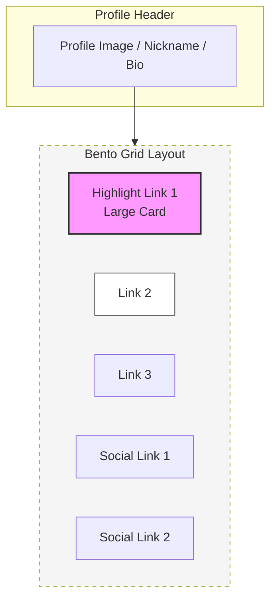
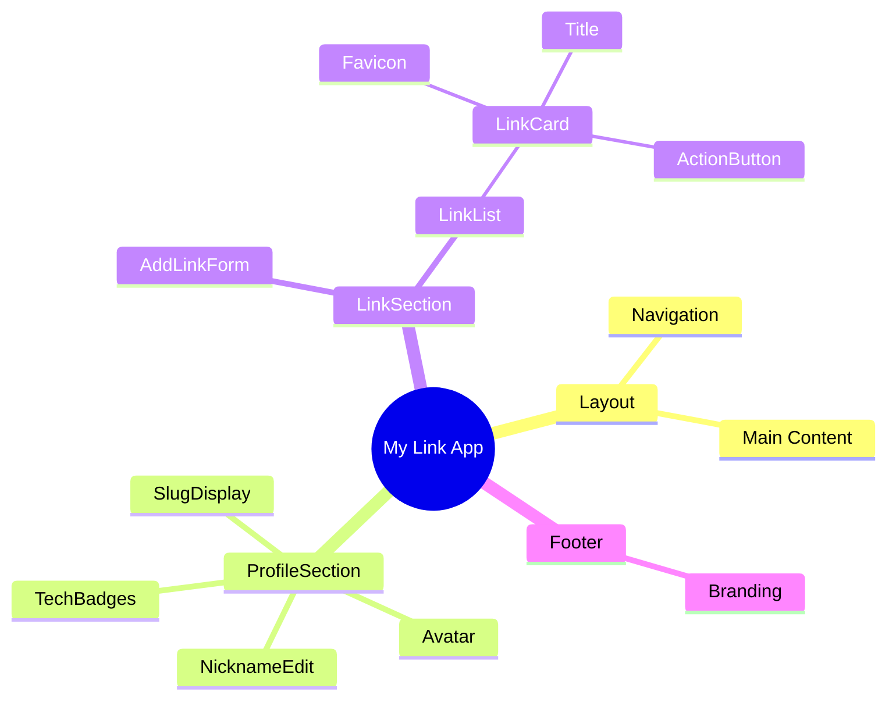

# 🖼️ MY LINK: WIREFRAMES (ver 1.0)

```text
    _  _  _  ___  ____  ____  ____  ____   __   _  _  ____ 
   ( \/ )( )(  _ \(  __)(  __)(  _ \(  _ \ (  ) ( \/ )(  __)
    \  /  )(  )   / ) _)  ) _)  )   / )   / /__\  \  /  ) _) 
     \/  (__)(__\_)(____)(__)  (__\_)(__\_)(__)(__)(__)(____)
   >> UI/UX Structure for Mobile & Desktop
```

---

## 1. 퍼블릭 페이지 (Visitor View)
방문자가 보는 최적화된 결과물입니다. `List` 형태의 표준 레이아웃입니다.

### 📱 Mobile Screen (Standard List)
```text
┌──────────────────────────────────────┐
│  [  ...  ] 📶                    12:00 │
├──────────────────────────────────────┤
│                                      │
│             (  IMAGE  )              │
│               PHOTO                  │
│                                      │
│             Nickname                 │
│          @slug / Bio Text            │
│                                      │
│    [React] [Next.js] [TypeScript]    │  <-- Tech Stack Badges
│                                      │
├──────────────────────────────────────┤
│                                      │
│  ┌────────────────────────────────┐  │
│  │ [F] My Portfolio Site       [>] │  │  <-- Link Card 1
│  └────────────────────────────────┘  │
│  ┌────────────────────────────────┐  │
│  │ [F] Official Blog           [>] │  │  <-- Link Card 2
│  └────────────────────────────────┘  │
│  ┌────────────────────────────────┐  │
│  │ [F] Twitter / X             [>] │  │  <-- Link Card 3
│  └────────────────────────────────┘  │
│                                      │
│          [ Powered by MyLink ]       │
└──────────────────────────────────────┘
```

---

## 2. 편집기 페이지 (Owner View)
소유자가 로그인했을 때의 화면으로, **인라인 편집** 요소가 추가됩니다.

### 🛠️ Editor Interface (Inline Edit)
```text
┌──────────────────────────────────────┐
│ [Logout]                    [Settings]│
├──────────────────────────────────────┤
│                                      │
│          (  IMAGE [^]  )             │
│            Photo Edit                │
│                                      │
│          Nickname [✏️]                │  <-- Click to edit
│       @slug / Bio Text [✏️]           │
│                                      │
│    [React] [Next.js] [TS]  [+]       │  <-- Add Badges
│                                      │
├──────────────────────────────────────┤
│                                      │
│  ┌─ [Add New Link] ────────────────┐ │
│  │ [ https://enter-url...    ] [ADD] │ │  <-- Sticky URL Input
│  └──────────────────────────────────┘ │
│                                      │
│  ┌────────────────────────────────┐  │
│  │ [F] My Portfolio Site    [X][=] │  │  <-- [X] Delete / [=] Drag
│  └────────────────────────────────┘  │
│  ┌────────────────────────────────┐  │
│  │ [F] Official Blog        [X][=] │  │
│  └────────────────────────────────┘  │
│                                      │
└──────────────────────────────────────┘
```

---

## 3. Bento 레이아웃 (Grid View - P1)
사용자가 강조하고 싶은 특정 링크를 카드 형태로 크게 배치하는 그리드 레이아웃입니다.

### 🍱 Bento Grid Structure (Mermaid)


---

## 4. 컴포넌트 계층 구조 (Hierarchy)



---

## 5. 시니어 기획자 코멘트
*   **핵심 규칙:** 모든 편집은 '저장' 버튼 없이 **자동 저장(Debounce)** 됩니다.
*   **UI 라이브러리:** `shadcn/ui`의 `Card`, `Badge`, `Input`, `Avatar` 컴포넌트를 베이스로 활용합니다.
*   **파비콘 연동:** 링크 카드의 `[F]` 영역은 URL 입력 완료 시 `Google Favicon API`를 통해 실시간으로 이미지를 불러와 교체합니다.
